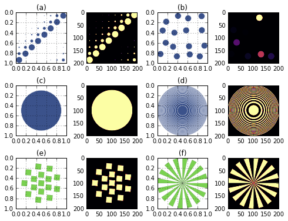

XDesign
#######

.. title:: XDesign

**XDesign** is an open-source Python package for creating x-ray imaging `phantoms <https://en.wikipedia.org/wiki/Imaging_phantom>`_, simulating `data acquisition <https://en.wikipedia.org/wiki/Data_acquisition>`_, and benchmarking x-ray `tomographic image reconstruction <https://en.wikipedia.org/wiki/Tomography>`_.

Goals
=====

* Assist faster development of new generation tomographic reconstruction methods
* Allow quantitative comparison of different reconstruction methods
* Create a framework for designing x-ray imaging experiments

Features
========

* Configurable analytic 2D phantoms.
* Various visualization tools for statistics.
* Analytic projection operators.

Contribute
==========

* Issue Tracker: https://github.com/tomography/xdesign/issues
* Documentation: https://github.com/tomography/xdesign/tree/master/doc
* Source Code: https://github.com/tomography/xdesign/tree/master/xdesign
* Tests: https://github.com/tomography/xdesign/tree/master/test

License
=======

The project is licensed under the
`BSD-3 <https://github.com/tomography/xdesign/blob/master/LICENSE.txt>`_ license.

Indices and tables
==================

* :ref:`genindex`
* :ref:`modindex`
* :ref:`search`

.. toctree::
   :maxdepth: 1

   api
   examples
   zrefs
   credits
