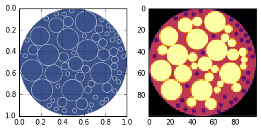
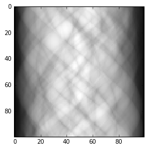
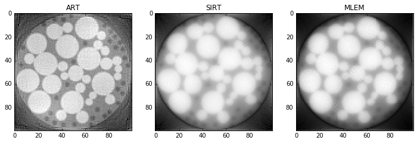
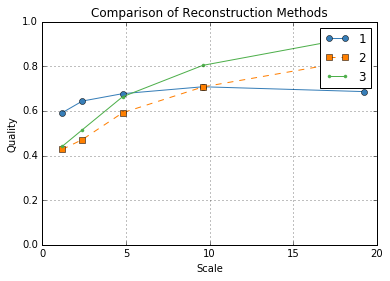
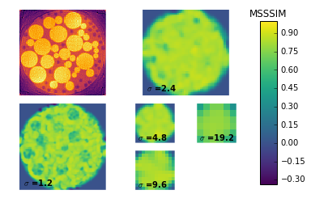
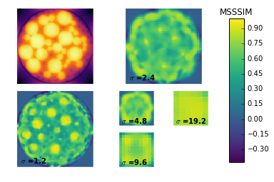
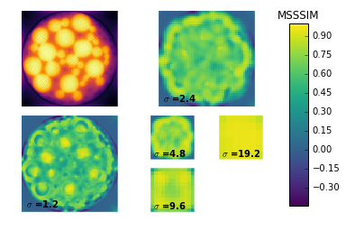

Quality Metrics and Reconstruction Demo
=======================================

Demonstrates the use of full reference metrics.

.. code:: python

    import numpy as np
    import matplotlib.pyplot as plt
    from skimage.exposure import adjust_gamma, rescale_intensity
    from xdesign import *
    
    
    def rescale(reconstruction, hi):
        I = rescale_intensity(reconstruction, out_range=(0., 1.))
        return adjust_gamma(I, 1, hi)

Generate a predetermined phantom that resembles soil.

.. code:: python

    np.random.seed(0)
    soil_like_phantom = Soil()

Generate a figure showing the phantom and save the discrete conversion
for later.

.. code:: python

    discrete = sidebyside(soil_like_phantom, 100)
    plt.savefig('Soil_sidebyside.png', dpi='figure',
            orientation='landscape', papertype=None, format=None,
            transparent=True, bbox_inches='tight', pad_inches=0.0,
            frameon=False)
    plt.show()

Simulate data acquisition for parallel beam around 180 degrees.

.. code:: python

    sx, sy = 100, 100
    step = 1. / sy
    prb = Probe(Point([step / 2., -10]), Point([step / 2., 10]), step)
    theta = np.pi / sx
    sino = np.zeros(sx * sy)
    a = 0
    for m in range(sx):
        for n in range(sy):
            update_progress((m*sy + n)/(sx*sy))
            sino[a] = prb.measure(soil_like_phantom)
            a += 1
            prb.translate(step)
        prb.translate(-1)
        prb.rotate(theta, Point([0.5, 0.5]))
    update_progress(1)

.. code:: python

    plt.imshow(np.reshape(sino, (sx, sy)), cmap='gray', interpolation='nearest')
    # plt.hist(sino)
    plt.show(block=True)

Reconstruct the phantom using 3 different techniques: ART, SIRT, and
MLEM

.. code:: python

    hi = 1  # highest expected value in reconstruction (for rescaling)
    niter = 10  # number of iterations
    
    init = 1e-12 * np.ones((sx, sy))
    rec_art = art(prb, sino, init, niter)
    rec_art = rescale(np.rot90(rec_art)[::-1], hi)
    
    init = 1e-12 * np.ones((sx, sy))
    rec_sirt = sirt(prb, sino, init, niter)
    rec_sirt = rescale(np.rot90(rec_sirt)[::-1], hi)
    
    init = 1e-12 * np.ones((sx, sy))
    rec_mlem = mlem(prb, sino, init, niter)
    rec_mlem = rescale(np.rot90(rec_mlem)[::-1], hi)

.. code:: python

    plt.figure(figsize=(12,4))
    plt.subplot(131)
    plt.imshow(rec_art, cmap='gray', interpolation='none')
    plt.title('ART')
    plt.subplot(132)
    plt.imshow(rec_sirt, cmap='gray', interpolation='none')
    plt.title('SIRT')
    plt.subplot(133)
    plt.imshow(rec_mlem, cmap='gray', interpolation='none')
    plt.title('MLEM')
    plt.show()

Compute quality metrics using the MSSSIM method.

.. code:: python

    metrics = compute_quality(discrete, [rec_art, rec_sirt, rec_mlem], method="MSSSIM")

Plotting the results shows the average quality at each level for each
reconstruction in a line plot. Then it produces the local quality maps
for each reconstruction so we might see why certain reconstructions are
ranked higher than others.

In this case, it's clear that ART is ranking higer than MLEM and SIRT at
smaller scales because the small dark particles are visible; whereas for
SIRT and MLEM they are unresolved. We can also see that the large yellow
circles have a more accurately rendered luminance for SIRT and MLEM
which is what causes these methods to be ranked higher at larger scales.

.. code:: python

    plot_metrics(metrics)
    plt.show()

