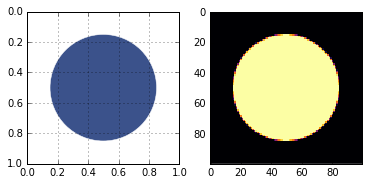
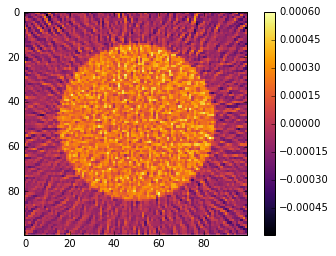
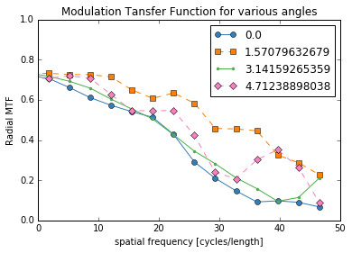
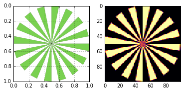
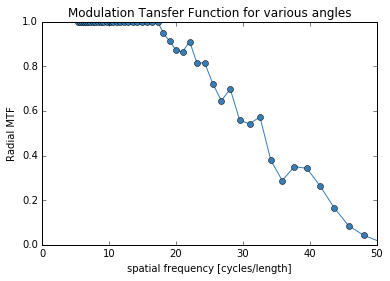
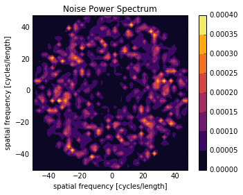
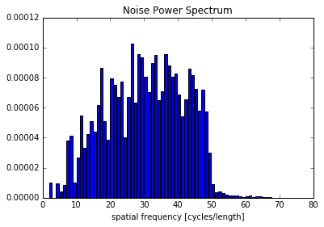
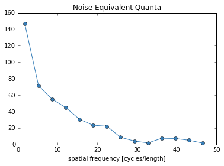

No Reference Metrics
====================

Demonstrates the use of the no-reference metrics: NPS, MTF, and NEQ.

.. code:: python

    from xdesign import *
    import tomopy
    import numpy as np
    import matplotlib.pylab as plt

Generate a UnitCircle test phantom. For the MTF, the radius must be less
than 0.5, otherwise the circle touches the edges of the field of view.

.. code:: python

    p = UnitCircle(mass_atten=4, radius=0.35)
    sidebyside(p, 100)
    plt.show()

Generate two sinograms and reconstruct. Noise power spectrum and Noise
Equivalent Quanta are meaningless withouth noise so add some poisson
noise to the reconstruction process with the ``noise`` argument.
Collecting two sinograms allows us to isolate the noise by subtracting
out the circle.

.. code:: python

    np.random.seed(0)
    sinoA = sinogram(100, 100, p, noise=0.1)
    sinoB = sinogram(100, 100, p, noise=0.1)
    theta = np.arange(0, np.pi, np.pi / 100.)
    
    recA = tomopy.recon(np.expand_dims(sinoA, 1), theta, algorithm='gridrec', center=(sinoA.shape[1]-1)/2.)
    recB = tomopy.recon(np.expand_dims(sinoB, 1), theta, algorithm='gridrec', center=(sinoB.shape[1]-1)/2.)

Take a look at the two noisy reconstructions.

.. code:: python

    plt.imshow(recA[0], cmap='inferno', interpolation="none")
    plt.colorbar()
    plt.savefig('UnitCircle_noise0.png', dpi=600,
            orientation='landscape', papertype=None, format=None,
            transparent=True, bbox_inches='tight', pad_inches=0.0,
            frameon=False)
    plt.show()

.. code:: python

    plt.imshow(recB[0], cmap='inferno', interpolation="none")
    plt.colorbar()
    plt.show()

.. image:: NoReferenceMetrics_files/NoReferenceMetrics_8_0.png

Calculate MTF
-------------

This metric is meaningful without noise. You can separate the MTF into
multiple directions or average them all together using the ``Ntheta``
argument.

.. code:: python

    mtf_freq, mtf_value, labels = compute_mtf(p, recA[0], Ntheta=4)

The MTF is really a symmetric function around zero frequency, so usually
people just show the positive portion. Sometimes, there is a peak at the
higher spatial frequencies instead of the MTF approaching zero. This is
probably because of aliasing noise content with frequencies higher than
the Nyquist frequency.

.. code:: python

    plot_mtf(mtf_freq, mtf_value, labels)
    plt.gca().set_xlim([0,50]) # hide negative portion of MTF
    plt.show()

You can also use a Siemens Star to calculate the MTF using a fitted
sinusoidal method instead of the slanted edges that the above method
uses.

.. code:: python

    s = SiemensStar(n_sectors=32, center=Point([0.5, 0.5]), radius=0.5)
    d = sidebyside(s, 100)

.. code:: python

    plt.show()

Here we are using the discreet verison of the phantom (without noise),
so we are only limited by the resolution of the image.

.. code:: python

    mtf_freq, mtf_value = compute_mtf_siemens(s, d)

.. code:: python

    plot_mtf(mtf_freq, mtf_value, labels=None)
    plt.gca().set_xlim([0,50]) # hide portion of MTF beyond Nyquist frequency
    plt.show()

Calculate NPS
-------------

You can also calculate the radial or 2D frequency plot of the NPS.

.. code:: python

    X, Y, NPS = compute_nps(p, recA[0], plot_type='frequency',B=recB[0])

.. code:: python

    plot_nps(X, Y, NPS)
    plt.show()

.. code:: python

    bins, counts = compute_nps(p, recA[0], plot_type='histogram',B=recB[0])

.. code:: python

    plt.figure()
    plt.bar(bins, counts)
    plt.xlabel('spatial frequency [cycles/length]')
    plt.title('Noise Power Spectrum')
    plt.show()

Calculate NEQ
-------------

.. code:: python

    freq, NEQ = compute_neq(p, recA[0], recB[0])

.. code:: python

    plt.figure()
    plt.plot(freq.flatten(), NEQ.flatten())
    plt.xlabel('spatial frequency [cycles/length]')
    plt.title('Noise Equivalent Quanta')
    plt.show()

