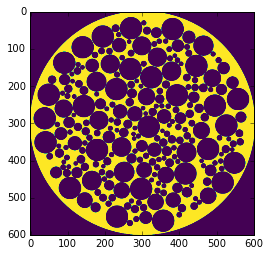
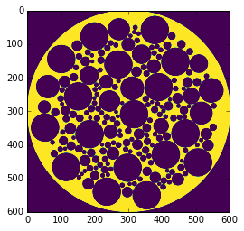
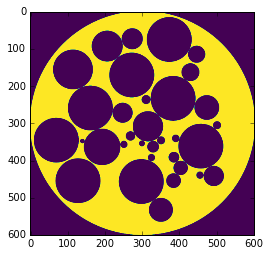
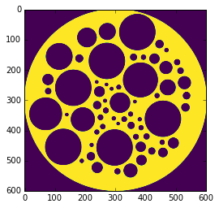
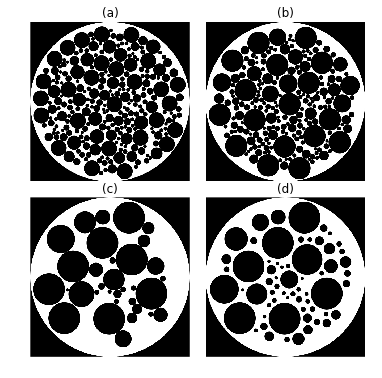

Parameterized Phantom Generation
================================

Demonstrates how a parameterized function can generate 4 different
phantoms from the same parameterized class.

.. code:: python

    from xdesign import *
    import matplotlib.pyplot as plt
    import numpy as np
    import matplotlib.gridspec as gridspec
    
    SIZE = 600

.. code:: python

    np.random.seed(0) # random seed for repeatability
    p1 = Foam(size_range=[0.05, 0.01], gap=0, porosity=1)
    d1 = discrete_phantom(p1, SIZE)
    plt.imshow(d1, cmap='viridis')
    plt.show()

.. code:: python

    np.random.seed(0) # random seed for repeatability
    p2 = Foam(size_range=[0.07, 0.01], gap=0, porosity=0.75)
    d2 = discrete_phantom(p2, SIZE)
    plt.imshow(d2, cmap='viridis')
    plt.show()

.. code:: python

    np.random.seed(0) # random seed for repeatability
    p3 = Foam(size_range=[0.1, 0.01], gap=0, porosity=0.5)
    d3 = discrete_phantom(p3, SIZE)
    plt.imshow(d3, cmap='viridis')
    plt.show()

.. code:: python

    np.random.seed(0) # random seed for repeatability
    p4 = Foam(size_range=[0.1, 0.01], gap=0.015, porosity=0.5)
    d4 = discrete_phantom(p4, SIZE)
    plt.imshow(d4, cmap='viridis')
    plt.show()

Create a composite figure of all four discrete phantoms.

.. code:: python

    fig = plt.figure(dpi=600)
    gs1 = gridspec.GridSpec(2, 2)
    gs1.update(wspace=0.1, hspace=0.1) # set the spacing between axes. 
    
    plt.subplot(gs1[0])
    plt.title('(a)')
    plt.axis('off')
    plt.imshow(d1, interpolation='none', cmap=plt.cm.gray)
    plt.subplot(gs1[1])
    plt.title('(b)')
    plt.axis('off')
    plt.imshow(d2, interpolation='none', cmap=plt.cm.gray)
    plt.subplot(gs1[2])
    plt.title('(c)')
    plt.axis('off')
    plt.imshow(d3, interpolation='none', cmap=plt.cm.gray)
    plt.subplot(gs1[3])
    plt.title('(d)')
    plt.axis('off')
    plt.imshow(d4, interpolation='none', cmap=plt.cm.gray)
    fig.set_size_inches(6, 6)
    plt.savefig('Foam_parameterized.png', dpi='figure',
            orientation='landscape', papertype=None, format=None,
            transparent=True, bbox_inches='tight', pad_inches=0.0,
            frameon=False)
    plt.show()

