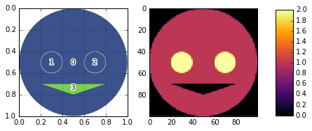
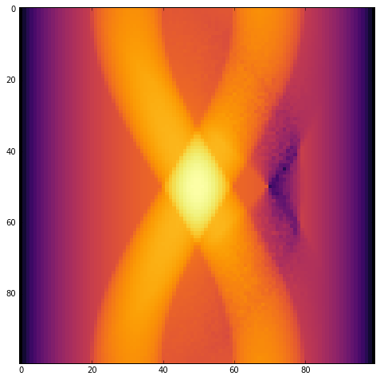

Simple Phantom Construction Demo
================================

Demonstrates simple basic custom phantom and sinogram generation.

.. code:: python

    import matplotlib.pyplot as plt
    import numpy as np
    from xdesign import *

Create various ``Features`` with geometries and assign attenuation
``values`` to each of the ``Features``.

.. code:: python

    head = Feature(Circle(Point([0.5, 0.5]), radius=0.5))
    head.mass_atten = 1
    eyeL = Feature(Circle(Point([0.3, 0.5]), radius=0.1))
    eyeL.mass_atten = 1
    eyeR = Feature(Circle(Point([0.7, 0.5]), radius=0.1))
    eyeR.mass_atten = 1
    mouth = Feature(Triangle(Point([0.2, 0.7]), Point([0.5, 0.8]), Point([0.8, 0.7])))
    mouth.mass_atten = -1

Add 'Features' to 'Phantom'.

.. code:: python

    Shepp = Phantom()
    Shepp.append(head)
    Shepp.append(eyeL)
    Shepp.append(eyeR)
    Shepp.append(mouth)

Plot the ``Phantom`` geometry and properties with a colorbar.

.. code:: python

    fig = plt.figure(figsize=(7, 3), dpi=600)
    
    # plot geometry
    axis = fig.add_subplot(121, aspect='equal')
    plt.grid('on')
    plt.gca().invert_yaxis()
    plot_phantom(Shepp, axis=axis, labels=False)
    
    # plot property
    plt.subplot(1, 2, 2)
    im = plt.imshow(discrete_phantom(Shepp, 100, prop='mass_atten'), interpolation='none', cmap=plt.cm.inferno)
    
    # plot colorbar
    fig.subplots_adjust(right=0.8)
    cbar_ax = fig.add_axes([0.85, 0.16, 0.05, 0.7])
    fig.colorbar(im, cax=cbar_ax)
    
    # save the figure
    plt.savefig('Shepp_sidebyside.png', dpi=600,
            orientation='landscape', papertype=None, format=None,
            transparent=True, bbox_inches='tight', pad_inches=0.0,
            frameon=False)
    plt.show()

Simulate data acquisition for parallel beam around 180 degrees.

.. code:: python

    sx, sy = 100, 100
    step = 1. / sy
    prb = Probe(Point([step / 2., -10]), Point([step / 2., 10]), step)
    theta = np.pi / sx
    sino = np.zeros(sx * sy)
    
    a = 0
    for m in range(sx):
        for n in range(sy):
            update_progress((m*sy + n)/(sx*sy))
            sino[a] = prb.measure(Shepp)
            a += 1
            prb.translate(step)
        prb.translate(-1)
        prb.rotate(theta, Point([0.5, 0.5]))
    update_progress(1)

Plot the sinogram.

.. code:: python

    plt.figure(figsize=(8, 8))
    plt.imshow(np.reshape(sino, (sx, sy)), cmap='inferno', interpolation='nearest')
    plt.savefig('Shepp_sinogram.png', dpi=600,
            orientation='landscape', papertype=None, format=None,
            transparent=True, bbox_inches='tight', pad_inches=0.0,
            frameon=False)
    plt.show()

