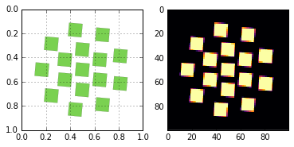
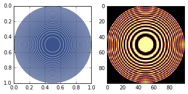
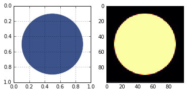
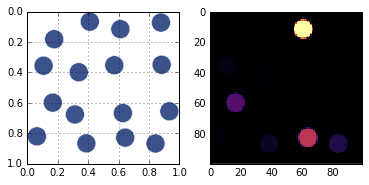
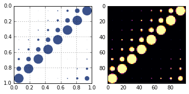
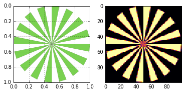
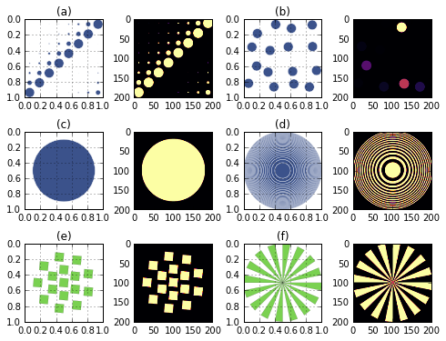

Standard Test Patterns
======================

Generates sidebyside plots of all the standard test patterns in xdesign.

.. code:: python

    from xdesign import *
    import numpy as np
    import matplotlib.pyplot as plt
    import matplotlib.gridspec as gridspec

.. code:: python

    p = SlantedSquares(count=16, angle=5/360*2*np.pi, gap=0.01)
    sidebyside(p)
    plt.savefig('SlantedSquares_sidebyside.png', dpi='figure',
            orientation='landscape', papertype=None, format=None,
            transparent=True, bbox_inches='tight', pad_inches=0.0,
            frameon=False)
    plt.show()

.. code:: python

    h = HyperbolicConcentric()
    sidebyside(h)
    plt.savefig('HyperbolicConcentric_sidebyside.png', dpi='figure',
            orientation='landscape', papertype=None, format=None,
            transparent=True, bbox_inches='tight', pad_inches=0.0,
            frameon=False)
    plt.show()

.. code:: python

    u = UnitCircle(radius=0.4, mass_atten=1) 
    sidebyside(u)
    plt.savefig('UnitCircle_sidebyside.png', dpi='figure',
            orientation='landscape', papertype=None, format=None,
            transparent=True, bbox_inches='tight', pad_inches=0.0,
            frameon=False)
    plt.show()

.. code:: python

    d = DynamicRange(steps=16, jitter=True, shape='square')
    sidebyside(d)
    plt.savefig('DynamicRange_sidebyside.png', dpi='figure',
            orientation='landscape', papertype=None, format=None,
            transparent=True, bbox_inches='tight', pad_inches=0.0,
            frameon=False)
    plt.show()

.. code:: python

    l = DogaCircles(n_sizes=8, size_ratio=0.5, n_shuffles=0)
    l.rotate(np.pi/2, Point([0.5, 0.5]))
    sidebyside(l)
    plt.savefig('DogaCircles_sidebyside.png', dpi='figure',
            orientation='landscape', papertype=None, format=None,
            transparent=True, bbox_inches='tight', pad_inches=0.0,
            frameon=False)
    plt.show()

.. code:: python

    s = SiemensStar(32)
    sidebyside(s)
    plt.savefig('SiemensStar_sidebyside.png', dpi='figure',
            orientation='landscape', papertype=None, format=None,
            transparent=True, bbox_inches='tight', pad_inches=0.0,
            frameon=False)
    plt.show()

.. code:: python

    fig = plt.figure(figsize=(8, 6), dpi=600)
    gs1 = gridspec.GridSpec(3, 4)
    gs1.update(wspace=0.4, hspace=0.4) # set the spacing between axes. 
    phantoms = [l, d, u, h, p, s]
    letters = ['a','b','c','d','e','f','g']
    for i in range(0, len(phantoms)):
        axis = plt.subplot(gs1[2*i], aspect=1)
        plt.grid('on')
        plt.gca().invert_yaxis()
        plot_phantom(phantoms[i], axis=axis)
        plt.title('('+ letters[i] +')')
        plt.subplot(gs1[2*i+1], aspect=1)
        plt.imshow(discrete_phantom(phantoms[i], 200), cmap='inferno')
    
    plt.savefig('standard_patterns.png', dpi='figure',
            orientation='landscape', papertype=None, format=None,
            transparent=True, bbox_inches='tight', pad_inches=0.0,
            frameon=False)
    plt.show()

