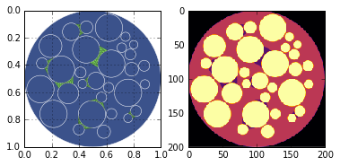
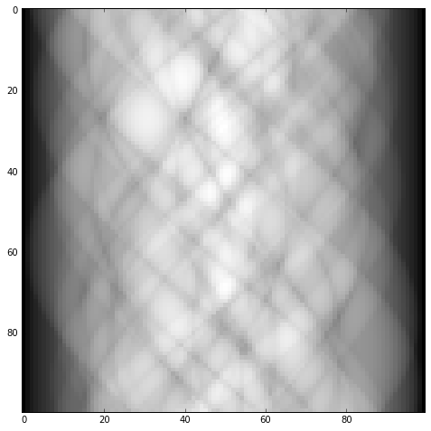
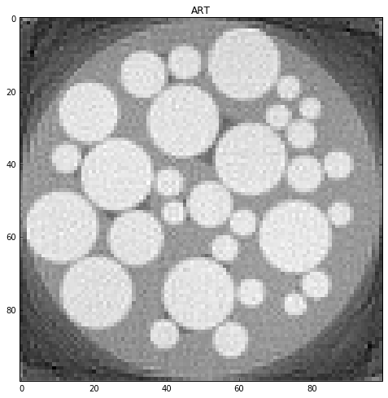
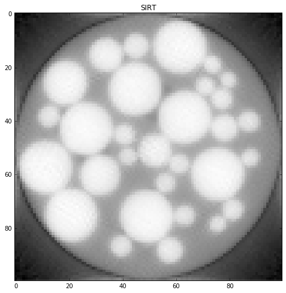
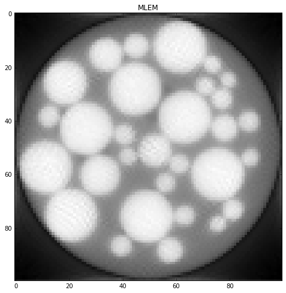

Wet Circles
===========

.. code:: python

    import numpy as np
    from scipy.spatial import Delaunay
    import matplotlib.pyplot as plt
    from xdesign import *
    from skimage.exposure import adjust_gamma, rescale_intensity
    
    
    def rescale(reconstruction, hi):
        I = rescale_intensity(reconstruction, out_range=(0., 1.))
        return adjust_gamma(I, 1, hi)

.. code:: python

    wet = WetCircles()
    sidebyside(wet, size=200)
    plt.savefig('Wet_sidebyside.png', dpi='figure',
            orientation='landscape', papertype=None, format=None,
            transparent=True, bbox_inches='tight', pad_inches=0.0,
            frameon=False)
    plt.show(block=True)

.. code:: python

    sx, sy = 100, 100
    step = 1. / sy
    prb = Probe(Point([step / 2., -10]), Point([step / 2., 10]), step)
    theta = np.pi / sx
    sino = np.zeros(sx * sy)
    a = 0
    for m in range(sx):
        for n in range(sy):
            update_progress((m*sy + n)/(sx*sy))
            sino[a] = prb.measure(wet)
            a += 1
            prb.translate(step)
        prb.translate(-1)
        prb.rotate(theta, Point([0.5, 0.5]))
    
    
    plt.figure(figsize=(8, 8))
    plt.imshow(np.reshape(sino, (sx, sy)), cmap='gray', interpolation='nearest')
    plt.show(block=True)

.. code:: python

    hi = 1
    niter = 20
    # Reconstruct object.
    init = 1e-12 * np.ones((sx, sy))
    rec_art = art(prb, sino, init, niter)
    rec_art = rescale(np.rot90(rec_art)[::-1], hi)
    plt.figure(figsize=(8, 8))
    plt.imshow(rec_art, cmap='gray', interpolation='none')
    plt.title('ART')
    
    init = 1e-12 * np.ones((sx, sy))
    rec_sirt = sirt(prb, sino, init, niter)
    rec_sirt = rescale(np.rot90(rec_sirt)[::-1], hi)
    plt.figure(figsize=(8, 8))
    plt.imshow(rec_sirt, cmap='gray', interpolation='none')
    plt.title('SIRT')
    
    init = 1e-12 * np.ones((sx, sy))
    rec_mlem = mlem(prb, sino, init, niter)
    rec_mlem = rescale(np.rot90(rec_mlem)[::-1], hi)
    plt.figure(figsize=(8, 8))
    plt.imshow(rec_mlem, cmap='gray', interpolation='none')
    plt.title('MLEM')
    plt.show()

